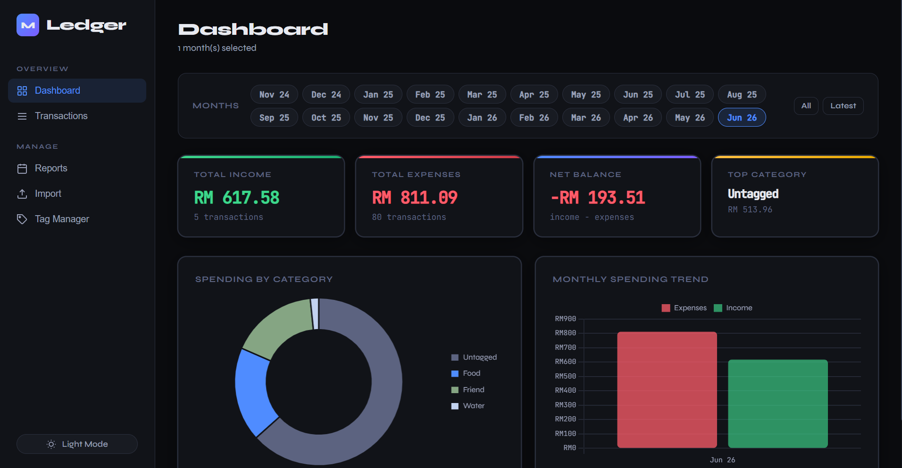
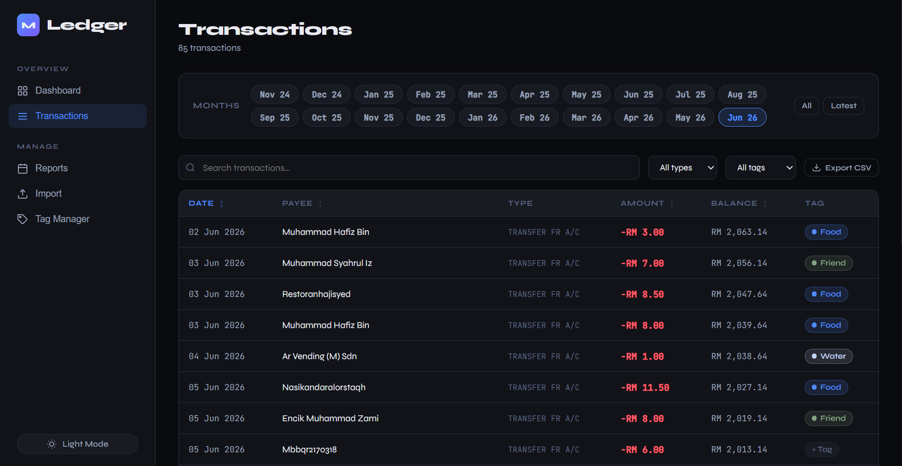
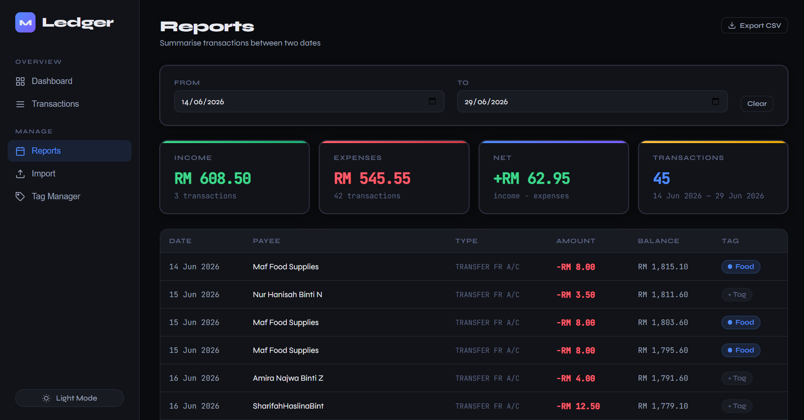
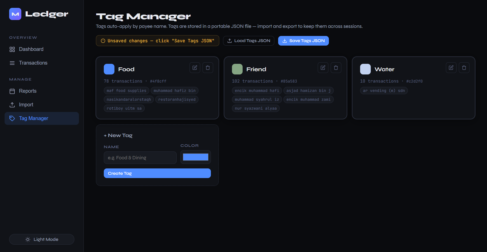

# Ledger — React Edition

A local web app for importing, tagging, and analysing Maybank (and RHB) PDF bank statements. All data stays on your machine — no accounts, no cloud, no third-party servers.

---

## Screenshots






---

## How It Works

Ledger is a two-process app: a small Python backend that reads your PDF, and a React frontend that handles everything else.

```
Your PDF statement
      │
      ▼
Flask backend (app.py)          ← runs on http://127.0.0.1:5000
  • Extracts text from the PDF
  • Detects bank format (Maybank / RHB)
  • Parses transactions + statement metadata
  • Returns structured JSON
      │
      ▼
React frontend (Vite)           ← runs on http://localhost:5173
  • Renders the JSON into a transaction list
  • Verifies balances match the statement totals
  • Stores everything in your browser's localStorage
  • Lets you tag, filter, search, and chart your spending
```

The frontend is entirely static after the initial PDF import — once a statement is parsed, the backend is no longer involved. Transactions persist in `localStorage` between sessions.

---

## Requirements

| Requirement | Version |
|---|---|
| Python | 3.9 or newer |
| Node.js | 18 or newer |
| npm | 9 or newer |

The app has been tested on macOS and Linux. Windows users may need to run the two startup commands in separate terminal windows.

---

## Installation

### 1. Clone the repository

```bash
git clone <repo-url>
cd maybank-statement-ledger
```

### 2. Install Python dependencies

```bash
pip install -r requirements.txt
```

### 3. Install Node dependencies

```bash
npm install
```

---

## Running the App

Both processes must be running at the same time. Open two terminal tabs.

**Terminal 1 — Flask backend:**
```bash
python app.py
# Listening on http://127.0.0.1:5000
```

**Terminal 2 — React frontend (dev mode):**
```bash
npm run dev
# Listening on http://localhost:5173
```

Then open **http://localhost:5173** in your browser.

### Production build

If you want a single deployable bundle instead of the Vite dev server:

```bash
npm run build      # output written to dist/
```

Serve the `dist/` folder with any static host (Nginx, Caddy, GitHub Pages, etc.). The Flask backend must still be reachable at `http://127.0.0.1:5000` for PDF import to work.

---

## Usage

### Importing a statement

1. Go to **Import** in the sidebar.
2. Drag and drop one or more Maybank or RHB PDF statement files onto the drop zone, or click **Browse Files** to pick them.
3. Each file is sent to the Flask backend, parsed, and added to your transaction list.
4. A balance verification check runs automatically — a ✓ means the parsed totals match the statement's own BEGINNING/ENDING BALANCE figures.

> **Password-protected PDFs:** Remove the password from the PDF before importing. The app will display a clear error message if it encounters a protected file.

### Dashboard

Shows a summary for the selected time period:

- Total income, total expenses, and net balance
- Spending breakdown by tag (pie chart)
- Monthly spending trend (bar chart)
- Use the month filter at the top to focus on one or more months

### Transactions

A searchable, filterable table of all imported transactions. You can:

- Search by payee name or description
- Filter by month, tag, or transaction type (debit / credit)
- Assign or change a tag on any transaction inline

### Reports

Generate a summary for a custom date range. Set a **From** and **To** date to see all transactions in that period, with income/expense totals.

### Tag Manager

Tags let you categorise your spending (e.g. Food, Transport, Utilities).

- **Create** a tag with a name and a colour.
- **Auto-tagging:** when you tag a transaction, the payee is remembered. Future imports from the same payee are tagged automatically.
- **Export tags** as a `tags.json` file to back them up or share across devices.
- **Import tags** from a previously saved `tags.json` to restore your setup.

---

## Data & Privacy

- **Nothing leaves your machine.** PDF parsing happens on `127.0.0.1` — the Flask server only accepts connections from `localhost` and the Vite dev server.
- **Transactions are stored in `localStorage`** in your browser. They are not sent anywhere after the initial PDF parse.
- **PDF files are not stored.** The backend writes the uploaded file to a temporary path, parses it, and deletes it immediately — win or lose.
- **Tags are stored in `localStorage`** and can be exported to a local JSON file for backup.
- Clearing your browser's site data for `localhost` will erase all transactions and tags. Export your tags before doing so.

---

## Testing

### Python backend tests

```bash
pip install -r requirements-dev.txt
pytest
```

The test suite uses synthetic PDFs generated by `reportlab` — no real bank statements are needed.

### Frontend unit tests (Vitest)

```bash
npm test             # run once
npm run test:watch   # re-run on file changes
```

Tests live in `src/utils/__tests__/` and cover the statement parser and tag utilities.

### Linting

```bash
npm run lint         # oxlint
```

---

## Troubleshooting

**"No text could be extracted from this PDF"**
Your statement is likely a scanned image rather than a text-based PDF. OCR is not currently supported. Download a fresh copy of the statement directly from Maybank2u or your internet banking portal — these are always text-based.

**"This PDF is password-protected"**
Open the PDF in Preview (macOS) or Adobe Acrobat, remove the password, save, and re-import.

**"Unrecognised bank statement format"**
Only Maybank current/savings account statements and RHB statements are supported. Credit card statements and statements from other banks will not parse correctly.

**Balance verification shows ✗ (fail)**
This means the sum of parsed transactions does not match the BEGINNING/ENDING BALANCE printed on your statement. It usually indicates a multi-page statement where one page failed to extract. Check that the full PDF was uploaded and try again. The transactions are still imported — the warning is informational.

**The frontend loads but imports fail (network error)**
Make sure `python app.py` is running in a separate terminal. The React app calls `http://127.0.0.1:5000/convert` for PDF parsing — if the backend is not running, imports will silently fail or show a network error.

**localStorage is getting full**
A warning appears in the app when storage usage approaches 4 MB. To free space, go to **Import** and delete statements you no longer need, or click **Clear All Data**.

**Port already in use**
If port 5000 is taken on macOS (Monterey+, AirPlay Receiver uses it), stop AirPlay Receiver under System Settings → General → AirDrop & Handoff, or change the port in `app.py`:
```python
app.run(host="127.0.0.1", port=5001, debug=False)
```
Then update the CORS origins list in `app.py` accordingly and restart both processes.

---

## Project Structure

```
maybank-statement-ledger/
├── app.py                  # Flask backend — PDF parsing & API
├── requirements.txt        # Python runtime dependencies
├── requirements-dev.txt    # Python test-only dependencies (pytest, reportlab)
├── package.json            # Node dependencies & scripts
├── vite.config.js          # Vite + Vitest config
├── index.html              # HTML entry point
├── styles.css              # Global styles (production build)
├── src/
│   ├── main.jsx            # React entry point
│   ├── App.jsx             # Root component, routing, theme
│   ├── context/
│   │   └── AppContext.jsx  # Global state (transactions, tags, localStorage)
│   ├── pages/
│   │   ├── Dashboard.jsx   # Charts & summary cards
│   │   ├── Transactions.jsx# Searchable transaction list
│   │   ├── Reports.jsx     # Date-range reports
│   │   ├── Import.jsx      # PDF upload UI
│   │   └── Tags.jsx        # Tag management
│   ├── components/         # Shared UI components
│   ├── hooks/              # useTagManager, useConfirm, usePagination
│   └── utils/
│       ├── parseStatement.js   # Frontend JSON→transaction parser
│       ├── tags.js             # Tag utilities & auto-tagging logic
│       └── __tests__/          # Vitest unit tests
└── tests/                  # pytest backend tests
    ├── test_parsers.py
    ├── test_routes.py
    └── conftest.py
```